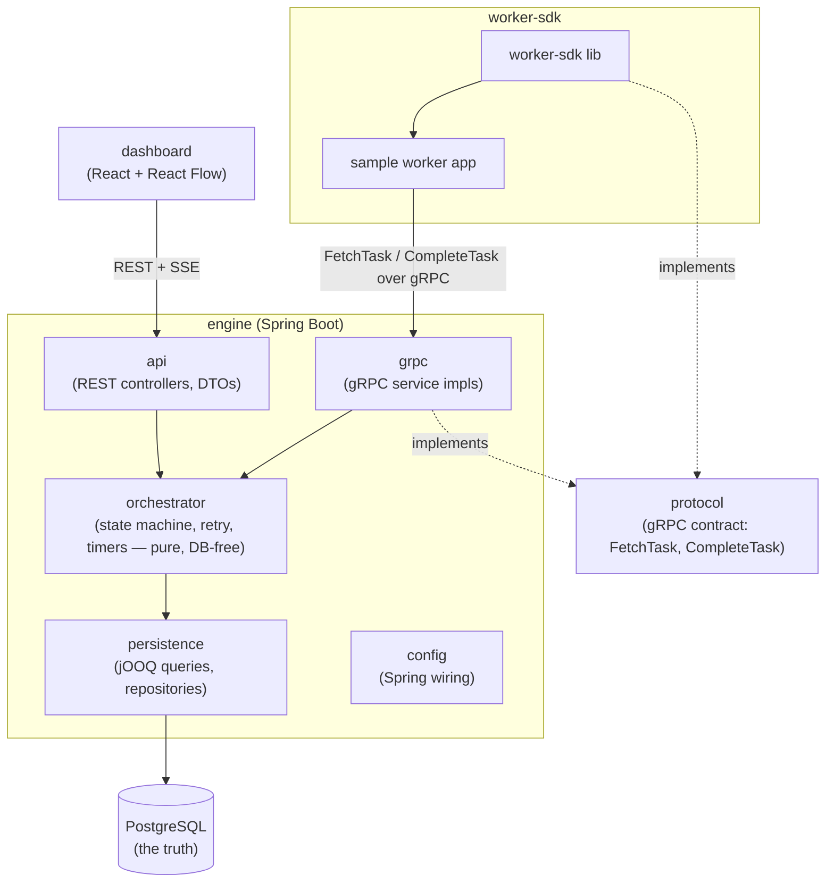
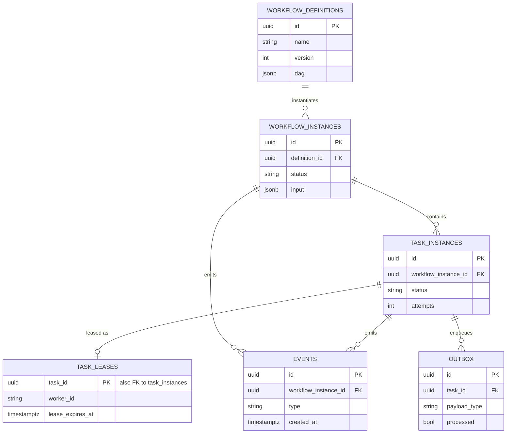

# Logical view

> **Keep in sync:** these diagrams describe the system as built. Whenever you change the architecture, modules, runtime flow, or deployment topology, update the affected view in the same change — do not let them drift.

Components and their dependencies. The `orchestrator` package is DB-free pure logic (state machine, retry policy, timers); `persistence` is the only package that talks jOOQ/SQL. `protocol` is the gRPC contract shared by the engine and the worker SDK, so engine and workers can never drift on the wire format.

## Module responsibilities

| Module                | Responsibility                                                                        |
|-----------------------|---------------------------------------------------------------------------------------|
| `dashboard`           | React SPA; observes and controls runs via REST + SSE.                                 |
| `engine/api`          | REST controllers and DTOs — submit/query and dead-letter list/redrive surface.        |
| `engine/grpc`         | gRPC service implementations — the worker-facing fetch/complete surface.              |
| `engine/orchestrator` | DAG resolution, state transitions, retry policy, timer wheel. Pure logic, no DB.      |
| `engine/persistence`  | jOOQ queries and repositories. The only package that knows SQL.                       |
| `engine/config`       | Spring Boot wiring — datasource, gRPC server, beans.                                  |
| `protocol`            | Shared gRPC/protobuf contract between `engine/grpc` and `worker-sdk`.                 |
| `worker-sdk`          | Java client library for writing workers, plus a sample worker app.                    |
| PostgreSQL            | Single source of truth for all workflow and task state.                               |

## Data model

Six tables (see [ARCHITECTURE.md](../ARCHITECTURE.md#data-model) for full column detail and status semantics). Overview only — PKs/FKs and a couple of key fields per table.

