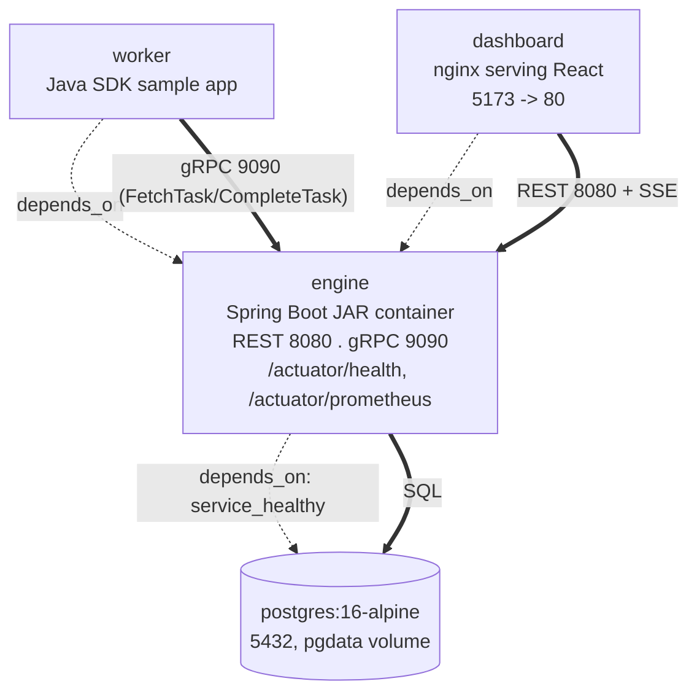

# Physical view

> **Keep in sync:** these diagrams describe the system as built. Whenever you change the architecture, modules, runtime flow, or deployment topology, update the affected view in the same change — do not let them drift.

Deployment topology as expressed in [docker-compose.yml](../../docker-compose.yml): everything comes up with one `docker compose up`. Dotted arrows are `depends_on` startup order; thick arrows are runtime traffic.

## Services

| Service     | Image / build                          | Ports        | Purpose                                             |
|-------------|------------------------------------------|--------------|--------------------------------------------------------|
| `postgres`  | `postgres:16-alpine`                     | `5432:5432`  | Sole state store; `pgdata` volume for durability.       |
| `engine`    | build from `engine/Dockerfile`           | `8080` REST, `9090` gRPC | Spring Boot JAR: REST API, gRPC service, orchestrator, migrations. |
| `worker`    | Java SDK sample app                      | none exposed | Long-polls the engine over gRPC, runs task handlers.    |
| `dashboard` | build from `dashboard/` (nginx + Vite build) | `5173:80`    | Serves the React SPA; talks to the engine over REST/SSE. |

Startup order: `postgres` must report healthy before `engine` starts (Flyway migrations run on engine boot); `worker` and `dashboard` wait for `engine`.

"Fits on a single small VM" is the quality bar — no Kafka, no Redis, no Kubernetes. One `docker compose up` brings up the whole stack; `docker compose down -v` tears it down cleanly.
