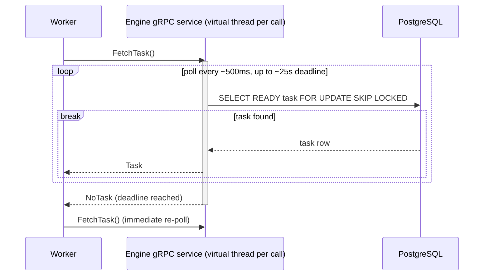

# Process view

> **Keep in sync:** these diagrams describe the system as built. Whenever you change the architecture, modules, runtime flow, or deployment topology, update the affected view in the same change — do not let them drift.

Runtime behavior as of M2 (single-task submit + execute, retries with backoff, lease heartbeat, crashed-worker recovery).

## Submit → execute happy path

```mermaid
sequenceDiagram
    actor Client
    participant API as Engine REST API
    participant DB as PostgreSQL
    participant GRPC as Engine gRPC service
    participant Worker

    Client->>API: POST /workflows
    API->>DB: INSERT workflow_instances (PENDING)
    API->>DB: INSERT task_instances (READY)
    API-->>Client: 201 Created (instance id)

    Worker->>GRPC: FetchTask()
    GRPC->>DB: SELECT ... FOR UPDATE SKIP LOCKED
    DB-->>GRPC: one READY task
    GRPC->>DB: INSERT task_leases row; task READY -> RUNNING
    GRPC-->>Worker: Task (with lease_expires_at)

    par handler on its own virtual thread
        Worker->>Worker: run handler
    and heartbeat every ~1/3 of remaining lease
        loop while handler runs
            Worker->>GRPC: Heartbeat(task_id, worker_id)
            GRPC->>DB: verify lease ownership; extend lease_expires_at
            GRPC-->>Worker: LeaseRenewed (or LeaseLost -> interrupt handler, no CompleteTask)
        end
    end
    Worker->>GRPC: CompleteTask(success)
    GRPC->>DB: verify lease ownership
    GRPC->>DB: task -> SUCCEEDED
    GRPC->>DB: instance -> SUCCEEDED
    GRPC->>DB: append events
    GRPC-->>Worker: ack

    Client->>API: GET /workflows/{id}
    API->>DB: SELECT instance
    API-->>Client: 200 OK (status: SUCCEEDED)
```

## Failure → retry loop

A failed attempt with retry budget left becomes a durable timer: the task flips to `RETRY_SCHEDULED` with `scheduled_at = now + backoff`, and the normal claim query picks it up directly once due — no promotion sweeper (ADR 0006).

```mermaid
sequenceDiagram
    participant Worker
    participant GRPC as Engine gRPC service
    participant DB as PostgreSQL

    Worker->>GRPC: CompleteTask(failure)
    GRPC->>DB: verify lease ownership
    alt attempts < maxAttempts
        GRPC->>DB: task -> RETRY_SCHEDULED, scheduled_at = now + backoff; delete lease
        GRPC->>DB: append TASK_RETRY_SCHEDULED event
        GRPC-->>Worker: ack
        Note over Worker,DB: backoff elapses (fixed or exponential, decision C)
        Worker->>GRPC: FetchTask()
        GRPC->>DB: claim due READY or RETRY_SCHEDULED task -> RUNNING, attempts+1
        GRPC-->>Worker: Task (next attempt)
    else retry budget exhausted
        GRPC->>DB: task -> FAILED; instance -> FAILED
        GRPC->>DB: append TASK_FAILED + WORKFLOW_FAILED events
        GRPC-->>Worker: ack
    end
```

## Worker crash → reap → re-dispatch

A dead worker stops heartbeating, so its lease expires. The engine's reaper (ADR 0008) runs every `engine.reaper-interval` (default 5s) plus once at startup, and resolves expired leases through the same failure path as a worker-reported failure — but **without backoff**: a crash says nothing bad about the task, so failover is prompt. The expired attempt stays consumed (it was taken at claim).

```mermaid
sequenceDiagram
    participant WA as Worker A
    participant GRPC as Engine gRPC service
    participant Reaper as Lease reaper (engine)
    participant DB as PostgreSQL
    participant WB as Worker B

    WA->>GRPC: FetchTask()
    GRPC-->>WA: Task (attempt 1)
    Note over WA: crashes mid-task - no heartbeats, no CompleteTask

    loop every reaper interval + once at startup
        Reaper->>DB: SELECT RUNNING tasks with lease_expires_at <= now FOR UPDATE SKIP LOCKED
        DB-->>Reaper: expired task
        Reaper->>DB: delete lease; append TASK_LEASE_EXPIRED
        alt attempts < maxAttempts
            Reaper->>DB: task -> RETRY_SCHEDULED, scheduled_at = now (no backoff)
        else budget exhausted
            Reaper->>DB: task -> FAILED; instance -> FAILED
        end
    end

    WB->>GRPC: FetchTask()
    GRPC->>DB: claim due task -> RUNNING, attempts+1
    GRPC-->>WB: Task (attempt 2)
    WB->>GRPC: CompleteTask(success)
```

## The gRPC long-poll mechanic

`FetchTask` is a long-lived call: the engine parks it on a virtual thread and polls the queue instead of returning immediately empty-handed.



## Concurrency notes

- **Per-workflow orchestration is single-threaded** (decision H). Parallelism comes from many workflows running concurrently, not from parallelizing one workflow's own scheduling.
- **At-least-once delivery** (decision F): a lease can expire and be re-handed to another worker, or a worker can crash after finishing but before acking. Handlers **must be idempotent** — this is a load-bearing product contract, not an implementation detail.

## Task status lifecycle

`PENDING → READY → RUNNING → SUCCEEDED` is the happy path. M2 adds the failure loop `RUNNING → RETRY_SCHEDULED → RUNNING` and the terminal `FAILED` when the retry budget runs out.

| Status            | When it appears                                                                          |
|-------------------|------------------------------------------------------------------------------------------|
| `PENDING`         | Waiting on DAG dependencies (not exercised yet — still single-task).                     |
| `READY`           | Eligible to be leased by a worker on the next `FetchTask` poll.                          |
| `RUNNING`         | Leased by a worker; a `task_leases` row holds the lease.                                 |
| `SUCCEEDED`       | Worker reported success. Terminal.                                                       |
| `FAILED`          | Worker reported failure and retries are exhausted. Terminal.                             |
| `RETRY_SCHEDULED` | Retry pending — worker failure (backoff) or lease expiry (no backoff); ADRs 0006, 0008.  |
| `CANCELLED`       | Externally cancelled. **Arrives with M6.**                                               |
