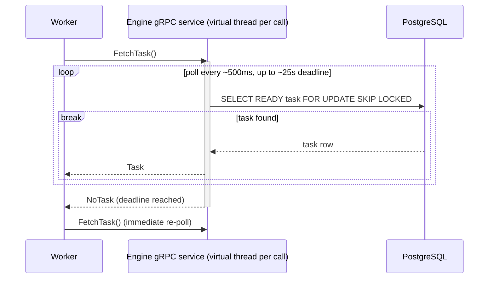

# Process view

> **Keep in sync:** these diagrams describe the system as built. Whenever you change the architecture, modules, runtime flow, or deployment topology, update the affected view in the same change — do not let them drift.

Runtime behavior for M1 (single-task submit + execute, no retries yet).

## Submit → execute happy path

```mermaid
sequenceDiagram
    actor Client
    participant API as Engine REST API
    participant DB as PostgreSQL
    participant GRPC as Engine gRPC service
    participant Worker

    Client->>API: POST /workflows
    API->>DB: INSERT workflow_instances (PENDING)
    API->>DB: INSERT task_instances (READY)
    API-->>Client: 201 Created (instance id)

    Worker->>GRPC: FetchTask()
    GRPC->>DB: SELECT ... FOR UPDATE SKIP LOCKED
    DB-->>GRPC: one READY task
    GRPC->>DB: INSERT task_leases row; task READY -> RUNNING
    GRPC-->>Worker: Task

    Worker->>Worker: run handler
    Worker->>GRPC: CompleteTask(success)
    GRPC->>DB: verify lease ownership
    GRPC->>DB: task -> SUCCEEDED
    GRPC->>DB: instance -> SUCCEEDED
    GRPC->>DB: append events
    GRPC-->>Worker: ack

    Client->>API: GET /workflows/{id}
    API->>DB: SELECT instance
    API-->>Client: 200 OK (status: SUCCEEDED)
```

## The gRPC long-poll mechanic

`FetchTask` is a long-lived call: the engine parks it on a virtual thread and polls the queue instead of returning immediately empty-handed.



## Concurrency notes

- **Per-workflow orchestration is single-threaded** (decision H). Parallelism comes from many workflows running concurrently, not from parallelizing one workflow's own scheduling.
- **At-least-once delivery** (decision F): a lease can expire and be re-handed to another worker, or a worker can crash after finishing but before acking. Handlers **must be idempotent** — this is a load-bearing product contract, not an implementation detail.

## Task status lifecycle

`PENDING → READY → RUNNING → SUCCEEDED` is the path exercised end-to-end in M1.

| Status            | When it appears                                                    |
|-------------------|------------------------------------------------------------------------|
| `PENDING`         | Waiting on DAG dependencies (not exercised yet — M1 is single-task).   |
| `READY`           | Eligible to be leased by a worker on the next `FetchTask` poll.        |
| `RUNNING`         | Leased by a worker; a `task_leases` row holds the lease.               |
| `SUCCEEDED`       | Worker reported success. Terminal.                                     |
| `FAILED`          | Worker reported failure and retries are exhausted. **Arrives with M2.** |
| `RETRY_SCHEDULED` | Worker failed, retry pending. **Arrives with M2.**                      |
| `CANCELLED`       | Externally cancelled. **Arrives with M6.**                             |
